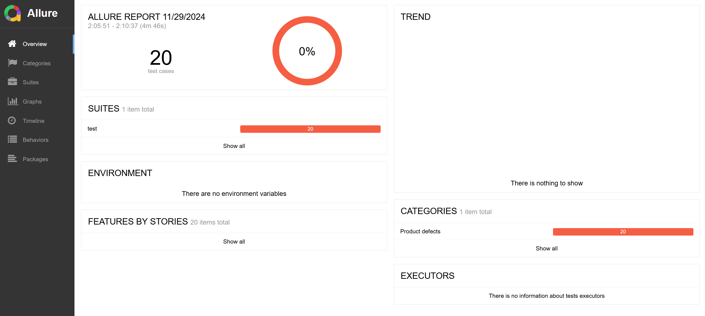

# Тестовое задание для INT-24
## Тестирование приложения OptimusMuneris

### Архитектура проекта
___

```
 ├── consts                 # папка с константами проекта
 ├── models                 # папка с моделями, используемыми в тестировании
 ├── steps                  # папка с методами взаимодействия с приложением
 ├── test                   # папка с тестами
 ├── utils                  # папка со вспомогательными функциями
 ├── .env                   # файл для хранения переменных, используемых в проекте
 ├── pytest.ini             # файл конфигурации Pytest
 ├── settings.py            # файл для трансформации переменных из .env файла
 └── .env                   # файл для хранения переменных, используемых в проекте
  
```
___
### Подробнее о проекте
___
В `.env` прописана переменная для нахождения исполняемого файла.

Для выполнения команд приложения был создан класс клиента - `CommandClient`, использующий библиотеку subprocess, принимающий путь до приложения, модуль который необходимо вызвать и аргументы. 

Был создан `CommandFacade` - класс для обращения к компонентам системы - `CommandClient` и `CommandSteps`.

`CommandSteps` - класс, где прописаны функции по взаимодействию с приложением.

Для создания данных, отправляемых на клиент, в проекте используется библиотека `dataclasses`. Были созданы датаклассы для всех модулей. Также был прописан `Enum` для определения возможных модулей.

Для множественных проверок используется `pytest-check`

Фикстуры прописаны в файле `conftest.py`. Есть только одна фикстура:
- api - для обращения к фасаду;

В автотестах используются pytest маркеры и параметризация. Тестовые данные прописаны в `test_data.py` и созданы для всех модулей приложения OptimusMuneris. Автотесты повторяют баг-репорты, описанные в pdf файле.

Для Windows и Linux немного различаются тесты для --add и --subtract, поэтому тесты нужно поочередно запустить на обеих платформах.

___
### Запуск всех автотестов
___
1. Выбрать операционную систему (Windows/Linux)

2. Установить необходимые библиотеки из requirements.txt;

3. Выполнить команду
    ```
    pytest -m "command" alluredir allure-results --clean-alluredir
    ```

4. Также для удобного просмотра результатов автотестов используется Allure. Для него нужно:
    - Установить Allure - подробная инструкция есть по этой ссылке: https://allurereport.org/docs/install-for-windows/
    - Сгенерировать из результатов репорт. Удобнее всего воспользоваться командой:
    ```
    allure serve allure-results
    ```
    - Запустится сервис и в браузере можно будет посмотреть результаты

5. Выполнить действия выше на другой операционной системе

Как выглядит:

